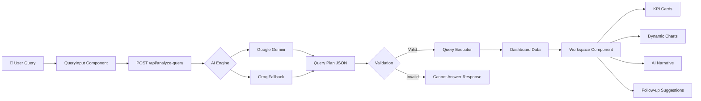

<div align="center">


# ✨ Viz.ai - Conversational AI for Business Intelligence

### _Ask a question. Get an interactive dashboard. Instantly._

[](https://nextjs.org/)
[](https://www.typescriptlang.org/)
[](https://ai.google.dev/)
[](https://tailwindcss.com/)
[](LICENSE)

**Viz.ai** transforms how you interact with business data. Simply type a question in plain English — _"Show me revenue by region"_ — and watch as AI generates a full interactive dashboard with charts, KPI cards, and executive-level insights. No SQL. No coding. Just answers.

---

[🚀 Quick Start](#-quick-start) •
[✨ Features](#-features) •
[🏗️ Architecture](#%EF%B8%8F-architecture) •
[📊 Try It](#-test-queries) •
[🛠 Tech Stack](#-tech-stack) •
[📁 Project Structure](#-project-structure)

</div>

---

## 🎯 What Makes Viz.ai Special?

<table>
<tr>
<td width="50%">

### 🧠 AI-First Analytics
No SQL required. Ask questions in natural language and Viz.ai's AI engine (powered by **Google Gemini**) interprets your intent, builds a query plan, executes it against your data, and renders a complete dashboard — all in seconds.

</td>
<td width="50%">

### 🛡️ Anti-Hallucination Engine
Unlike generic AI tools, Viz.ai validates every query against your actual data schema. If a question can't be answered from the available dataset, it says so clearly — and suggests better questions. **No made-up numbers. Ever.**

</td>
</tr>
<tr>
<td width="50%">

### 📊 Multi-Chart Dashboards
Each query generates 1–3 contextual charts (bar, line, pie, area, stacked) plus animated KPI cards and an AI-written executive summary — a complete analytical story, not just a single graph.

</td>
<td width="50%">

### 🌍 Real-Time Sharing
Dashboards are no longer ephemeral. Generate an insight, click "**Share**", and instantly get a unique, public URL to send to your team or embed in a presentation.

</td>
<td width="50%">

### 🔄 Compare Mode
Run two queries simultaneously and see their dashboards side-by-side using `react-resizable-panels`. Perfect for A/B testing segments or comparing time periods directly.

</td>
</tr>
<tr>
<td width="50%">

### 🔔 Auto-Insights Engine
Our deterministic analysis engine runs automatically on page load, scanning your dataset to surface critical **Anomalies**, **Trends**, and **Correlations** before you even ask a question.

</td>
<td width="50%">

### 💬 Conversational Context
Follow-up queries understand your previous questions. Ask _"Show revenue by region"_ then _"Now filter to Enterprise customers"_ — Viz.ai maintains full conversational context across queries.

</td>
</tr>
</table>

---

## ✨ Features

### 🔮 Core AI Capabilities

| Feature | Description |
|---------|-------------|
| **Natural Language Queries** | Ask questions like _"Show me revenue by region"_ and get instant dashboards |
| **Multi-Model AI Pipeline** | Google Gemini (primary) with Groq/Llama fallback for maximum reliability |
| **Intelligent Chart Selection** | AI picks the optimal chart type — with a green "recommended" indicator |
| **AI Narrative & Insights** | Every dashboard includes an executive summary explaining what the data reveals |
| **Follow-Up Suggestions** | AI generates 3 contextual follow-up questions after each query |
| **Hallucination Prevention** | Validates all columns against real schema; refuses to generate fake data |
| **Clarification Mode** | When a query is ambiguous, Viz.ai asks for clarification instead of guessing |

### 📈 Data & Visualization

| Feature | Description |
|---------|-------------|
| **Multi-Chart Dashboards** | Each query generates 1–3 contextual charts (bar, line, pie, area, stacked) |
| **Animated KPI Cards** | 2–4 key metrics with trend indicators for instant overview |
| **Compare Mode** | Render two dashboards side-by-side with resizable panels |
| **Dashboard Sharing** | Generate instant public URLs for any dashboard via MongoDB |
| **PDF Export** | Download any dashboard as a styled, client-side generated PDF |
| **Auto-Insights** | Proactive anomaly detection, trend analysis, and correlations on load |
| **Chart Type Switcher** | Switch any chart between bar/line/pie/area without re-querying |
| **Multi-Dataset Support** | Built-in Sales (155 rows), Insurance (149 rows), E-commerce, and HR datasets |

### 🎤 Input & Interaction

| Feature | Description |
|---------|-------------|
| **Voice Input** | Speak your query using Web Speech API (Chrome/Edge) |
| **CSV Upload** | Upload your own CSV/JSON files and query them instantly |
| **MongoDB Integration** | Connect to any MongoDB collection and query it with natural language |
| **AI Chat Panel** | Side panel for conversational follow-ups with formatted responses |
| **Rotating Placeholders** | Dynamic example queries cycle through the input field for inspiration |

### 🎨 Design & Experience

| Feature | Description |
|---------|-------------|
| **Dark Mode** | Full dark mode support with seamless toggle |
| **Responsive Design** | Collapsible sidebar, works on all screen sizes |
| **Skeleton Loading** | Progressive loading states while AI is processing |
| **Framer Motion Animations** | Smooth stagger animations for dashboards and transitions |
| **Glassmorphism UI** | Premium blur-backdrop headers and modern design language |

### 🔐 Auth & Management

| Feature | Description |
|---------|-------------|
| **User Authentication** | Full login/signup with session management |
| **Demo Mode** | Try features without signing up |
| **Admin Panel** | Admin-only panel for user management |
| **Query History** | Full timeline of past queries and generated dashboards |
| **Export History** | Download your conversation history as JSON |
| **Settings Panel** | Configure appearance, data source, and data management |

---

## 🛠 Tech Stack

<div align="center">

| Layer | Technology | Purpose |
|:---:|:---:|:---:|
| ⚡ **Framework** | Next.js 16 (App Router) | Server + Client rendering |
| 📝 **Language** | TypeScript 5 | Type-safe development |
| 🧠 **AI Engine** | Google Gemini API | Natural language understanding |
| 🔄 **AI Fallback** | Groq (Llama 3.3 / Mixtral) | Reliability when Gemini hits rate limits |
| 🎨 **Styling** | Tailwind CSS 4 | Utility-first responsive design |
| 📊 **Charts** | Recharts | Interactive data visualization |
| 🎬 **Animations** | Framer Motion | Smooth UI transitions |
| 📦 **State** | Zustand | Lightweight client state management |
| 🗄️ **Database** | MongoDB + Mongoose | User auth & persistent storage |
| 💾 **Local Storage** | Dexie.js (IndexedDB) | Client-side CSV data storage |
| 📋 **CSV Parsing** | PapaParse | Fast CSV file processing |
| 🎯 **Icons** | Lucide React | Beautiful icon library |
| 🧩 **UI Components** | shadcn/ui | Accessible component primitives |

</div>

---

## 🚀 Quick Start

### Prerequisites
- **Node.js** 18+ installed
- **Google Gemini API Key** — [Get one free](https://aistudio.google.com/apikey)

### Setup

```bash
# 1️⃣ Clone the repository
git clone https://github.com/your-username/viz-ai.git
cd viz-ai

# 2️⃣ Install dependencies
npm install

# 3️⃣ Set up environment variables
cp .env.example .env
```

Edit the `.env` file and add your API key:

```env
# Required
GOOGLE_GEMINI_API_KEY=your_gemini_api_key_here

# Optional — adds AI fallback provider
GROQ_API_KEY=your_groq_api_key_here

# Optional
NEXT_PUBLIC_APP_URL=http://localhost:3000
```

```bash
# 4️⃣ Start the development server
npm run dev

# 5️⃣ Open in browser
# → http://localhost:3000
```

> 💡 **No database setup required!** Viz.ai ships with 4 built-in datasets ready to query. MongoDB is only needed if you want to connect your own collections.

---

## 📊 Test Queries

Try these queries to see Viz.ai in action:

### 🟢 Simple Queries
| Query | What You'll See |
|-------|----------------|
| _"Show me total revenue by region"_ | Bar chart + KPI cards for all 4 regions |
| _"What is the revenue breakdown by product category?"_ | Pie chart showing category distribution |
| _"Who are the top 5 sales reps by revenue?"_ | Ranked bar chart of top performers |

### 🟡 Medium Complexity
| Query | What You'll See |
|-------|----------------|
| _"Show monthly revenue trend for 2024"_ | Line chart with 12-month time series |
| _"Compare revenue and cost by category"_ | Side-by-side bar chart comparison |
| _"Which customer segment generates the most orders?"_ | Pie chart with segment breakdown + KPIs |

### 🔴 Complex Queries
| Query | What You'll See |
|-------|----------------|
| _"Show Q3 revenue broken down by region"_ | Filtered bar chart with Q3-only data |
| _"What is the profit margin by product category?"_ | Calculated derived metric chart |
| _"Monthly revenue trend for Laptops in the North region"_ | Multi-filtered time series |

### 🔁 Follow-Up Queries (Conversational)
```
You: "Show revenue by region"
→ Viz.ai generates a bar chart with 4 regions

You: "Now filter to Enterprise customers"
→ Viz.ai maintains context, filters to Enterprise segment only

You: "Break this down by month"  
→ Generates monthly trend for Enterprise customers
```

### 🏥 Insurance Dataset Queries
Switch to the insurance dataset and try:
- _"Which insurer has the highest claims settlement ratio?"_
- _"Compare total claims paid by year"_
- _"What is the repudiation ratio by insurer?"_

---

## 🏗️ Architecture

### How a Query Flows Through Viz.ai



### Data Flow

```
┌─────────────────────────────────────────────────────────┐
│                    Frontend (React)                       │
│  ┌──────────┐  ┌───────────┐  ┌─────────────────────┐  │
│  │QueryInput│  │ ChatPanel │  │     Workspace       │  │
│  │(Voice+   │  │(Conversa- │  │  ┌─────┐ ┌───────┐ │  │
│  │ Text)    │  │ tional AI)│  │  │KPIs │ │Charts │ │  │
│  └────┬─────┘  └─────┬─────┘  │  └─────┘ └───────┘ │  │
│       │              │        │  ┌─────────────────┐ │  │
│       │              │        │  │  AI Narrative    │ │  │
│       │              │        │  └─────────────────┘ │  │
│       └──────┬───────┘        └──────────┬──────────┘  │
│              ▼                            ▲              │
│     ┌────────────────┐          ┌────────┴────────┐     │
│     │ Zustand Store  │◄────────►│ Dashboard State │     │
│     └────────┬───────┘          └─────────────────┘     │
└──────────────┼──────────────────────────────────────────┘
               ▼
┌──────────────────────────────────────────────────────────┐
│                  Backend (Next.js API)                     │
│  ┌─────────────────────────────────────────────────────┐ │
│  │              /api/analyze-query                      │ │
│  │  ┌──────────┐  ┌──────────────┐  ┌──────────────┐  │ │
│  │  │  Gemini  │  │Query Executor│  │Schema Validator│ │ │
│  │  │  + Groq  │  │   Engine     │  │(Anti-halluc.) │  │ │
│  │  └──────────┘  └──────────────┘  └──────────────┘  │ │
│  └─────────────────────────────────────────────────────┘ │
│                          ▼                                │
│  ┌──────────┐  ┌──────────────┐  ┌──────────────────┐   │
│  │sales.json│  │insurance.json│  │  MongoDB (opt.)   │   │
│  │ 155 rows │  │  149 rows    │  │  Any collection   │   │
│  └──────────┘  └──────────────┘  └──────────────────┘   │
└──────────────────────────────────────────────────────────┘
```

### AI Pipeline Detail

| Step | What Happens |
|------|-------------|
| **1. Intent Recognition** | Gemini parses the natural language query and determines chart type, filters, group-by, and aggregation |
| **2. Schema Validation** | Every referenced column is checked against the real dataset schema |
| **3. Hallucination Guard** | If the query references non-existent columns or impossible data, a clear "Cannot Answer" response is returned |
| **4. Query Execution** | The server-side query executor applies filters, group-by, aggregation, sorting, and limits |
| **5. Multi-Model Fallback** | If Gemini fails (429/timeout), the system automatically falls back through 4 Gemini models, then to Groq (3 models) |
| **6. Chart Rendering** | Recharts renders the data as the AI-recommended chart type with animations |

---

## 📁 Project Structure

```
viz-ai/
├── 📂 app/                          # Next.js App Router
│   ├── page.tsx                     # Root redirect → /dashboard
│   ├── layout.tsx                   # Root layout (Inter font, dark mode)
│   ├── globals.css                  # Global styles + Tailwind
│   ├── 📂 dashboard/page.tsx        # 🏠 Main dashboard workspace
│   ├── 📂 auth/page.tsx             # 🔐 Login / Signup
│   ├── 📂 admin/page.tsx            # 🛡️ Admin user management
│   ├── 📂 history/page.tsx          # 📜 Query history timeline
│   ├── 📂 sources/page.tsx          # 📊 Data source management
│   ├── 📂 insights/page.tsx         # 💡 AI-powered insights panel
│   ├── 📂 settings/page.tsx         # ⚙️ App configuration
│   ├── 📂 landing/page.tsx          # 🌐 Landing page
│   └── 📂 api/
│       ├── 📂 analyze-query/        # 🧠 Core AI + query execution endpoint
│       ├── 📂 auth/                 # 🔑 Auth endpoints (login/signup/logout)
│       ├── 📂 upload-dataset/       # 📤 Dataset upload endpoint
│       └── 📂 seed-demo-datasets/   # 🌱 Demo data seeding
│
├── 📂 components/
│   ├── 📂 charts/
│   │   ├── DynamicChart.tsx         # 📊 Multi-type chart renderer (bar/line/pie/area/stacked)
│   │   └── KPICard.tsx              # 📈 Animated KPI metric cards
│   ├── 📂 dashboard/
│   │   ├── Workspace.tsx            # 🖥️ Main dashboard grid (charts + KPIs + narrative)
│   │   ├── QueryInput.tsx           # 🎤 Voice + text query input with rotating placeholders
│   │   ├── ChatPanel.tsx            # 💬 AI conversational side panel
│   │   ├── ChatToggleButton.tsx     # 💬 Toggle button for chat panel
│   │   ├── DatasetUploader.tsx      # 📤 CSV/JSON file upload with preview
│   │   ├── DataSourceSelector.tsx   # 🔀 Data source picker (Server/CSV/MongoDB)
│   │   ├── SkeletonDashboard.tsx    # ⏳ Loading state skeleton
│   │   └── ErrorCard.tsx            # ❌ Styled error display
│   ├── 📂 layout/
│   │   ├── Sidebar.tsx              # 📱 Responsive navigation sidebar
│   │   ├── LogoBadge.tsx            # 🎨 Logo component
│   │   └── DarkModeProvider.tsx     # 🌙 Dark mode context provider
│   └── 📂 ui/                       # 🧩 shadcn/ui primitives
│
├── 📂 lib/
│   ├── gemini.ts                    # 🤖 Google Gemini API client
│   ├── queryExecutor.ts             # ⚡ Server-side data query engine
│   ├── localQueryEngine.ts          # 💻 Client-side query engine (for CSV uploads)
│   ├── localDatabase.ts             # 💾 IndexedDB (Dexie) wrapper
│   ├── mongodb.ts                   # 🗄️ MongoDB connection manager
│   ├── auth.ts                      # 🔐 Authentication utilities
│   └── useAuthSync.ts              # 🔄 Auth state synchronization hook
│
├── 📂 store/
│   ├── useDashboardStore.ts         # 📦 Main Zustand store (dashboard state)
│   └── useAuthStore.ts              # 🔐 Auth Zustand store
│
├── 📂 models/
│   ├── User.ts                      # 👤 Mongoose User model
│   └── Sales.ts                     # 📊 Mongoose Sales model
│
├── 📂 data/                         # 📁 Built-in datasets (no DB required!)
│   ├── sales.json                   # 🛒 155 sales records (2024)
│   ├── insurance.json               # 🏥 149 insurance claims records
│   ├── ecommerce.json               # 🛍️ E-commerce dataset
│   └── hr.json                      # 👥 HR/Employee dataset
│
├── 📂 types/
│   └── index.ts                     # 📝 Shared TypeScript type definitions
│
├── middleware.ts                    # 🛡️ Route protection middleware
├── .env.example                     # 🔧 Environment variable template
└── package.json                     # 📋 Dependencies & scripts
```

---

## 🔑 API Reference

### `POST /api/analyze-query`

The core AI endpoint that powers all of Viz.ai. Accepts a natural language query and returns complete dashboard data.

**Request Body:**
```json
{
  "prompt": "Show me revenue by region",
  "requestType": "dashboard",
  "dataSource": "server",
  "activeDatasetId": "preloaded-sales",
  "conversationHistory": [],
  "localSchema": [],
  "mongoCollection": null
}
```

**Request Types:**

| Type | Purpose | Response Format |
|------|---------|----------------|
| `dashboard` | Generate charts + KPIs + narrative | `{ metrics, charts, summary, followUpSuggestions }` |
| `chat` | Conversational text response | `{ message, followUpSuggestions }` |
| `insights-chat` | Structured insights with data highlights | `{ message, dataHighlights, conversationHighlights, followUpSuggestions }` |

**Response Modes:**

| Mode | When It Triggers |
|------|-----------------|
| `server` | Successfully executed server-side query |
| `local` | Returns query plan for client-side CSV execution |
| `chat` | Conversational text response |
| `cannotAnswer` | Query references invalid columns or impossible data |
| `clarification` | Query is too ambiguous to interpret |

---

## 🌐 Environment Variables

| Variable | Required | Description |
|----------|----------|-------------|
| `GOOGLE_GEMINI_API_KEY` | ✅ Yes | Your Gemini API key ([get one free](https://aistudio.google.com/apikey)) |
| `GROQ_API_KEY` | ❌ No | Groq API key for AI fallback reliability |
| `MONGODB_URI` | ❌ No | MongoDB connection string (only for custom collections) |
| `NEXT_PUBLIC_APP_URL` | ❌ No | App URL (defaults to `http://localhost:3000`) |

---

## 🧩 Built-in Datasets

Viz.ai ships with **4 ready-to-query datasets** — no database setup needed:

| Dataset | Records | Fields | Use Case |
|---------|---------|--------|----------|
| 🛒 **Sales 2024** | 155 | `order_id`, `date`, `product`, `category`, `region`, `sales_rep`, `revenue`, `cost`, `units_sold`, `customer_segment` | Revenue analysis, sales performance |
| 🏥 **Life Insurance Claims** | 149 | `life_insurer`, `year`, `claims_intimated`, `claims_paid`, `settlement_ratio`, `repudiation_ratio`, etc. | Insurance analytics, settlement patterns |
| 🛍️ **E-Commerce** | — | Product, orders, customer data | Online retail analytics |
| 👥 **HR / Employee** | — | Employee, department, performance data | Workforce analytics |

---

## 📜 Scripts

```bash
npm run dev      # Start development server (hot reload)
npm run build    # Production build
npm run start    # Start production server
npm run lint     # Run ESLint
```

---

## 🤝 Contributing

1. **Fork** the repository
2. **Create** a feature branch (`git checkout -b feat/amazing-feature`)
3. **Commit** your changes (`git commit -m 'Add amazing feature'`)
4. **Push** to the branch (`git push origin feat/amazing-feature`)
5. **Open** a Pull Request

---

<div align="center">

## 📄 License

Released under the **MIT License**.

---

**Built with 💜 by the Viz.ai team**

_Powered by Google Gemini AI • Next.js 16 • TypeScript_

<br />

⭐ **Star this repo** if Viz.ai impressed you!

</div>
